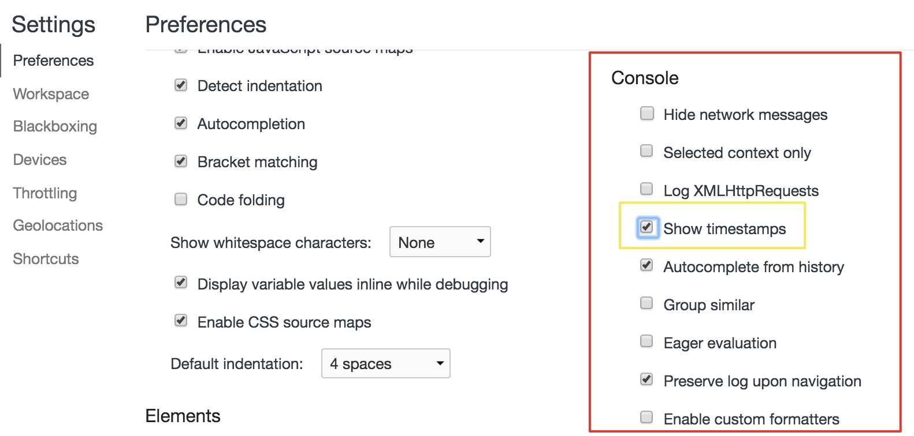
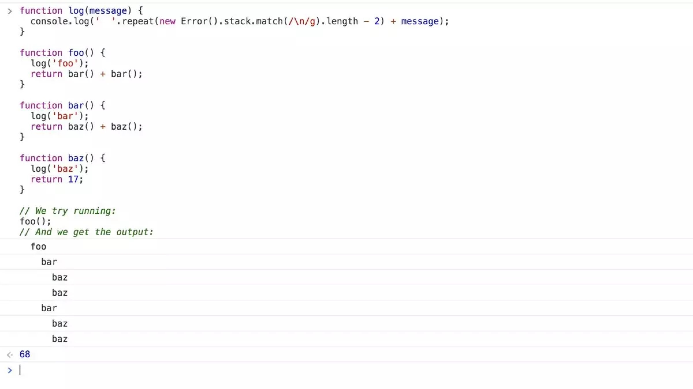
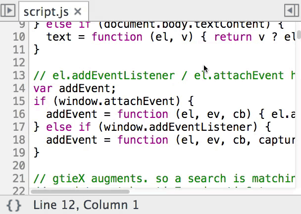
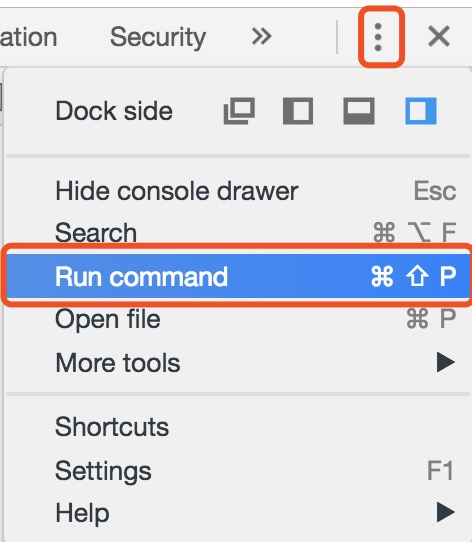
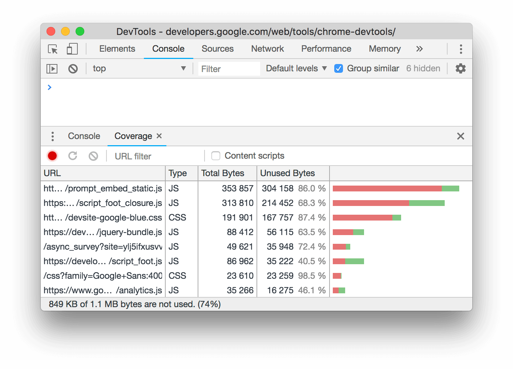
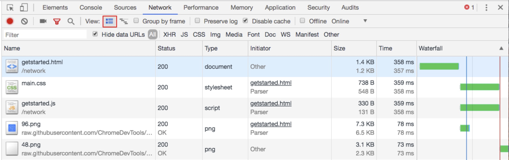
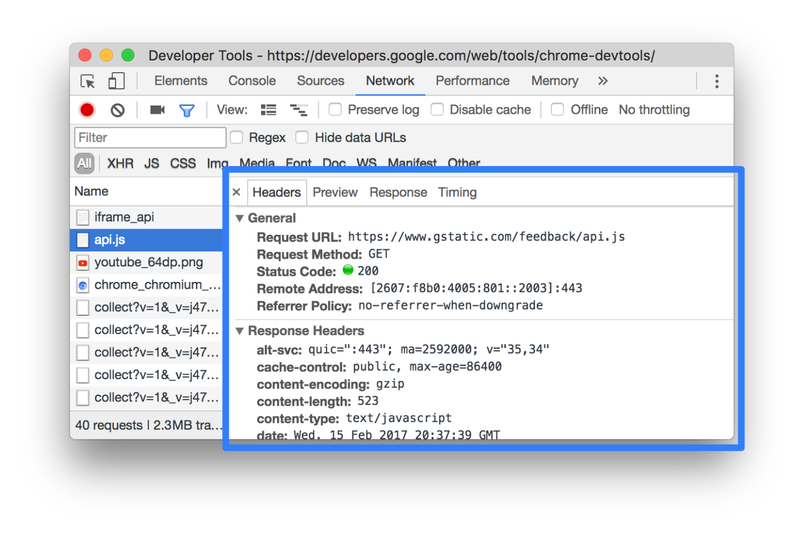

# Chrome DevTools（`Cmd+Opt+I`）

## 1 介绍

Chrome DevTools是内嵌在Chrome浏览器里的一组用于网页制作和调试的工具。 
工欲善其事必先利其器，熟练的使用DevTools能够大大提高我们的工作效率。

## 2 Elements

### 2.1 HTML面板（元素）

#### 2.1.1 元素选择

* 页面鼠标移动到元素 > 右键 > 检查 > 打开开发者工具后自动将鼠标定位的元素选中，背景高亮成蓝色。
* 点击检查元素icon （快捷键：`command + shift + c`），鼠标在页面中选中元素背景被高亮成蓝色。
* 打开开发者工具，点击dom树的某个元素节点，选中节点的背景被高亮成蓝色。
* 在console面板中执行`document.querySelector()`，如`document.querySelector('p')`会打印出选中的`

`元素

* 查看选中元素DOM层级的直观方式

#### 2.1.2 交换元素位置
* drag拖拽 
场景：当你想要看看页面某部分在DOM树的不同位置将如何显示的时候，只需拖动并且放置它(到指定的位置)

* 使用command按钮 
场景：如果只是想在DOM结构中往上一点或者往下一点的移动当前被选中的元素，可以使用`[⌘] + [⬆] / [⌘] + [⬇]`。

#### 2.1.3 删除元素
（1）选中元素，按delete 
（2）右键 -> Delete element

#### 2.1.4 选中元素 —> 右键
* Add/Edit Attributes、Edit as HTML、Copy、Hide element、Force state、Scroll into view......

#### 2.1.5 Tips
* 显示、隐藏元素 
场景：可以按下'h'来隐藏在元素面板中被你选中的元素，再次按下'h'使它出现。某些时候这是很有用的，例如你想截图，但是又不想里面包含一些敏感信息。

* 基础编辑器 
(1) 使用`cmd + z` 撤销我们的任何改动。 
(2) 使用`cmd + shift + z` 重新编辑我们的任何修改。

* 展开所有子节点：右击节点后选择`expand recursively`（递归展开）

* 快速控制节点的展开与折叠 
左键（left）：折叠子元素； 
右键（right）：展开子元素； 
`[⬆]/[⬇]`：上下选择节点；

###  2.2 DOM样式(CSS)、结构

#### 2.2.1 styles

##### 2.2.1.1 修改、添加、搜索class属性、新增style样式
* 选中类 > 点击空白 > 输入样式（输入之后按Enter保存样式）
* color颜色选择器（鼠标点击颜色方块会出现颜色选择器） 
改变颜色格式：在颜色预览中用`Shift + Click`，可以在rgba，hsl和hexadecimal（十六进制）这三种格式中切换。

* （1）显示和隐藏css属性; 
（2）引用外部文件样式，点击文件打开source，定位到对应样式； 
（3）鼠标hover到三个点icon，可以添加`text-shadow`、`box-shadow`、`color`、`background-color`，点击+icon可以添加新的style样式。

* 添加、隐藏类名：点击`.cls`
* 添加新的style样式：点击`.cls`旁边的`+`图标

##### 2.2.1.2 设置标签不同状态的样式
* 点击`:hov`可以选择不同的状态

* 在线调伪类样式 
选中a标签 > 右键 > `force element state` > 选择想要调试的伪类，在标签前会出现一个黄色的小圆点，就可以直接调伪类样式了。

##### 2.2.1.3 快速同步定位页面视图到选中元素(`Scroll Into View`)
场景：页面视图显示靠底部，选中的dom节点元素在靠上位置。 
操作：选中元素 > 右键 > `scroll into view`使视图快速回到dom选中元素位置

##### 2.2.1.4 快速查找节点
* `cmd + f`(搜索元素)

##### 2.2.1.5 编辑DOM节点
* 修改内容：双击选中元素的内容即可修改

* 添加属性 
(1) 双击节点元素名称，右边出现空白即可添加属性 
(2)选中元素 > 右键 >  `add attributes`

* 修改元素 
(1) 双击节点元素名称，元素名称会被高亮 > 输入新的元素名称

* 保存编辑、替换内容
（1）`cmd + Enter` 
（2）点击编辑部分之外的地方保存编辑内容

##### 2.2.1.6 Tips
* `Shadow editor`阴影编辑器

* `Timing function editor`定时函数编辑器（`Cubic bezier`贝塞尔 编辑器）：贝塞尔曲线是一串用来定义CSS的动画速度在整个动画过程中如何变化的魔法数值。 
设置为`transition-timing-function`或者 `animation-timing-function`CSS属性。 
**注意**：如果`timing`函数的值没有设置在`trasition`, `animation`简写的形式中，这个符号不会显示出来)边上的曲线符号

#### 2.2.2 如何在`console`面板快速打出相应节点？
##### 2.2.2.1 $
* `$0~$4`：最近选择过的5个DOM节点。`$0`返回最近一次选择的DOM节点(或当前节点)，以此类推，`$1`返回上上次选的DOM节点。最多可保存5个，如果不满5个，则返回undefined。
* `Store as global variable`：将元素存储为全局变量，保存之后节点的全局变量名为temp1、temp2...以此类推。 
场景：需要多次返回某一个节点

#### 2.2.3 DOM Breakpoints
场景：当js修改了DOM节点（如修改节点的属性）时可以给DOM节点打断点来调试。

#### 2.2.4 computed窗格

##### 2.2.4.1 查看元素盒模型
* 查看width、height、padding、border、margin...度量单位可以是px、百分比、vm等。

##### 2.2.4.2 关于computed中的样式
* 显示顺序是按字母顺序显示
* 显示的是真正作用在元素上的样式：style中的样式可能是全部的样式，包括一些不起作用的样式。可实时查看更新样式是否生效。
* 查看继承的css属性
* 勾选computed中的`show all`复选框，展示元素所有的属性样式。

* 通过filter可以过滤/查找某些属性/值（styles、computed...都有这个选项）

#### 2.2.5 检查动画`Animations`
* 作用： 
（1）检查动画 
（2）修改动画
* 打开方式： 
（1）`command menu`，搜索animations打开； 
（2）或者在styles窗格按animations按钮打开。

#### 2.2.6 `EventListeners`

#### 2.2.7 `Properties`
查看元素具有的方法与属性，比查API手册要方便。

## 3 Console

### 3.1 打开

#### 3.1.1 直接打开Devtools，切换到console面板

#### 3.1.2 在其它面板中打开console抽屉
* `command menu` > 搜索console > 选择`Drawer Show Console`
* 打开console面板时，console抽屉式导航栏将自动折叠。

### 3.2 日志级别 ([demo](https://devtools.glitch.me/console/log.html))

#### 3.2.1 日志来源
* 代码捕捉的日志
* 浏览器或框架捕捉的日志（如404、500、undefined、null等异常错误）

#### 3.2.2 类型
`console.log()`、`console.info()`、`console.warn()`、`console.error()`、`console.debug()`

#### 3.2.3 消息输出
* 如果一条消息连续重复，控制台不会在新行上输出每一个消息实例，而是将堆叠消息合并，在左侧外边距显示一个数字，表示该消息已重复的次数。

如果想为每一个日志使用一个独特的行条目，可以在settings中的console项启用`Show timestamps`；或在`command menu`中打开`timestamps`。

#### 3.2.4 console过滤
* filter选择过滤不同类型的console信息。 
日志严重级别：Verbose（冗长）、Info、Warning、Error

* 正则过滤 `live expressions`

#### 3.2.5 sidebar(侧边栏)

### 3.3 console API
* `console.table()`格式化输出

* `console.group()`、 `console.groupEnd()`：将信息进行分组管理，在信息量较大时使用比较有优势。

* `console.dir()`：将一个对象以JSON表达式的格式打印。

场景：`console.log()`会将这个交互式的元素渲染成像是从Elements中剪切出来的一样。如果想要查看这个节点所关联到的真实的JavaScript对象，查看节点的属性等等，这样的情况下，如果需要更加直接表现形式来展示数据，就可以使用`console.dir()`。

* `console.dirxml()`：将节点的后代节点以xml格式打印出

* `console.trace()`： 可以打出js的函数调用栈
* `console.time()`、`console.timeEnd()` ：计算一段代码间消耗的时间（监测代码执行时间） 
`console.time()`开启一个计时器； 
`console.timeEnd()`结束计时并将结果在console中打印出来。

如果想一次记录多件事，可以往这些函数中传入不同的标签值。 
**例如**：`console.time('loading')`, `console.timeEnd('loading')`

* `console.profile()` 、`console.profileEnd()` ：查看CPU的消耗
* `console.count()` ：相同的日志当前被打印的次数，比如一个函数被执行的次数。 
`console.countRest()`：重置count
* `console.assert(expression, object)` ：
assert（断言）：用于保证程序的正确性，只有当express的值为false，则在控制台上打印错误信息。
* `console.debug()`、`console.info()`、`console.warn()`、`console.error()`......
* `debug()`、`keys()`、`dir()`......

### 3.4 console历史记录

#### 3.4.1 清空console历史记录
* 清空按钮
* 控制台输入`clear()`
* `ctrl + l`
* 在控制台中点击右键，然后按`Clear console`
* JavaScript代码内调用`console.clear()` 
**注意**：如果勾选了`preserve log`，则`console.clear()`会被禁用，使用无效。

#### 3.4.2 保留历史记录
* 启用`preserve log`可以在页面刷新或更改之间保留控制台历史记录。 
消息将一直存储，直到清空控制台或关闭标签。

#### 3.4.3 保存console历史记录
* 控制台中点击右键，然后选择`Save as`，将控制台的输出保存到日志文件中。

### 3.5 $
* `$0~$4`：打出选中的元素，上一次选中的元素，上上次选中的元素...以此类推
* `$_`：返回最近使用的表达式的结果（对上次执行结果的引用）； 如果`$_`表达式是一个数组，则可以用`$_.length`获取数组的长度
* `$()`: `document.querySelector()`返回第一个与之匹配的css选择器，如`$('div')`返回本页的第一个div元素。
* `$$()`：`document.querySelectorAll()`返回一个数组，与之匹配的css选择器的元素。如`$$('div')`返回所有的div元素组成的数组
* `$i`：引入一些npm库

### 3.6 console设置
* setting设置console模块
* console面板点击设置icon

### 3.7 Tips
* console代码换行：Chrome控制台回车默认是执行，要想输入换行，应按`Shift + Enter`
* copy()：复制一个具体对象的字符串表达式到剪切板，如`copy($0)`
* `getEventListeners(domElement)`返回在DOM元素上注册的所有的事件

* `Store as global variable`： 
  场景：如果在console中打印了一堆数据(例如App中计算出来的一个数组)，然后想对这些数据进行其它额外操作（如使用copy）。 
  操作：将它转换成一个全局变量：右击 —> 选择`Store as global variable`(保存为全局变量)。第一个保存变量会创建一个名为`temp1`的变量，然后是`temp2`等等，这样就可以操作各样的数据，而不用担心他们会被复写。

* 保存堆栈 
打印出堆栈 —> 右键 save as

* `console.log()`基于调用堆栈自动缩进

* DevTools已经支持直接使用await

场景：`async/await`使得异步操作变得更加容易和可读，唯一的问题在于await需要在async函数中使用。如果在低版本DevTools的控制台想使用`async/await`需要一些特殊的处理，但是现在新版本开发工具已经支持直接使用await。

参考链接：<https://juejin.im/post/5c0fdfc46fb9a049b13e0d82>

## 4 sources

### 4.1 调试

#### 4.1.1 sources面板
（1）文件导航窗格：列出了页面请求的每个文件； 
（2）代码编辑窗格：在文件导航窗格选择文件后，代码编辑窗格会显示选中文件的内容； 
（3）js调试窗格：检查页面js的各种工具。

#### 4.1.2 js调试窗格

* 调试按钮从左到右： 
1. 暂停/继续脚本执行：如果一个函数里有大量代码，但是大部分代码与定位的问题无关，点击该按钮（或者光标放到下一个要执行的断点行然后右键选择`continue to here`可以直接到该行的`debugger`）可用于跳过冗长的代码片段，执行到下一个断点处（与定位问题相关的代码处）。 
2. 单步调试（快捷键f10）：不遇到函数，执行下一步；遇到函数，不进入函数，直接执行下一步； 
3. 进入函数调试（快捷键f11）：不遇到函数，执行下一步；遇到函数，进入函数执行上下文； 
4. 跳出当前函数； 
5. 禁止所有的断点，停止任何调试； 
6. 程序运行遇到异常时是否中断调试
* `watch`: 调试过程中监听某些变量值的变化
* `call stack`: 函数调用栈； 
拷贝调用栈：右键 —> `copy stack trace`

**Tips**：
`Blackbox a script`：屏蔽无关代码 
（1）场景：假如使用了第三方库、文件，如果你确定你所调试的问题与第三方文件无关，可以开启脚本黑盒的调试方式，开启黑盒调试后调用栈不会出现第三方文件的方法，调试也不会进入到第三方文件的函数中，可以绕过冗长的第三方或更深层次的嵌套，提高调试效率。 
（2）操作： 
a. 在已打开的文件中，右键 —> `Blackbox a script` 
b. 在`Call Stack`中，右键 -> `Blackbox Script` 
c. `Settings` -> `Blockboxing` -> `add pattern`，下拉菜单中，选择Blackbox黑箱，Disabled阻止执行

**`Blackbox a script`&&`call stack`**：调用栈在排查问题时是很有用的，函数的执行有执行上下文，函数由最外层到最内层依次压入栈中，在执行的时候，依次从栈中弹出，这样就可以从最内层沿着链找到最外层，排查错误时也是这个道理。 
有时遇到不知名的错误，可能是调用第三方的，也可能是底层的，总之不是自己写的代码。遇到这种情况就可以尝试用调用栈的方法，沿着链去找源头，不过调用栈中可能混杂了不是自己写的函数，这时候`Blackbox script`就派上用场了。

**Tips**：Network表格中的类似调用栈的Initiator也可以结合`Blackbox a script`更快速的定位问题。

* `scope`: 作用域链（代码中有闭包时scope窗格关注会多些，比如调试闭包中的this指向）。
* `breakpoints`: 设置的断点全部显示在这里，可以快速定位到文件中断点的位置。
* `XHR/fetch breakpoints`: 发请求的断点，比如可以在发ajax请求中打的断点。
* `DOM Breakpoints`: js改变dom节点属性、dom节点子节点树改动、移除dom节点操作时打的断点全部显示在这个窗格。
* `global listeners`: 全局监听器 
在浏览器中window是全局对象，所以在`Global Listeners`面板中显示绑定在window对象上的事件监听。
* `event listener breakpoints`：事件监听断点，比如鼠标的click事件，键盘keydown事件等。勾选事件前面的单选框即可监听该事件。
  
### 4.2 断点（`Break points`）
在代码执行过程中暂停代码，同时检查所有相关的变量的值。

#### 4.2.1 添加断点的方式
* 可以在代码里加`debugger`调试；
* 在代码编辑窗格直接打断点

#### 4.2.2 DOM相关的断点(`DOM Breakpoints`)
* 子节点树改变、节点属性改变、节点移除

#### 4.2.3 条件断点(`Conditional breakpoints`)
* 场景：有时设置的断点被执行太多次了：比如有一个对200个元素的循环，但我们只对第110次循环的结果感兴趣，或者只对一些满足其他的特殊条件的结果感兴趣，这样的情况下就可以设置一个条件断点。
* 操作： 
（1）右击行号并且选择`Add conditional breakpoint`(添加条件断点)的选项 
（2）或者右击一个已经设置的断点并且选择`Edit breakpoint`(编辑断点) 
（3）然后输入一个执行结果为true或者false的表达式（它的值并不需要明确的为true或者false，可以是表达式的结果为true或false）。如果条件满足的话，断点就会暂停代码的执行。

参考链接：<https://juejin.im/post/5c16d943518825566d2365f3>

### 4.3 代码格式化
* `pretty print` {} ：反压缩js代码

### 4.4 快速打开文件
将项目文件直接拖到Source面板，DevTools会将对文件的修改同步到系统文件中。

### 4.5 `workspaces`
工作区支持即时同步样式

### 4.6 Tips
1. `command + p`: 直接定位到某一行。如图，直接定位到第33行第14列。

2. 快速查找文件&搜索特定字符串

3. 多行插入编辑内容：在Sources编辑框中，按住Cmd，在要编辑的地方点击鼠标，可以设置多个插入符。按下Ctrl + U撤销编辑，快速输入，快速删除。

4. 多列内容选择 & 匹配相同选项： 
   （1）多列内容选择：按住Opt键，当鼠标箭头变为“+”号后，点击鼠标； 
   （2）匹配相同选项：选中需要匹配的元素，快捷键`Cmd + D`

5. `snippets`: 在任何页面创建、运行、保存代码段、小脚本。

snippets执行脚本

6. `Overrides`重写 
   场景：在开发工具上调试css/js时，修改的属性值或代码在重新刷新页面时，所有的修改会被重置。如果想把修改的值保存下来，在页面刷新的时候不会被重置，可以使用overrides特性。

   Overrides默认是关闭的，需手动开启： 
   （1）打开Sources面板 
   （2）选择Overrides字标签 
   （3）选择 `+Select folder for overrides`为Overrides设置一个保存重写属性的目录。

7. `Content scripts` 
   Chrome拓展注入在网页中的脚本。

   

8. `corverage`：获取关于冗余代码的摘要-细节信息 
步骤1：打开`command menu (command + shift + p)`

步骤2：搜索`corverage`命令

步骤3：打开coverage窗格，start开始统计当前加载页面的代码，reload按钮开始统计并重新加载页面

步骤4：coverage窗格展示了在浏览器加载时每个加载的css和js文件中有多少使用和未使用的部分。（绿色是已使用的，红色是未使用的）

步骤5：点击文件可以一行一行查看哪些部分被使用了哪些未被使用。

8. `Drawer change`：检查修改的内容（将更改的内容与最初加载的样式进行比较，类似于Git），也可以撤销改动。

## 5 Network

### 5.1 工具栏

#### 5.1.1 `Preserve log`（跨页面加载保存请求）
如页面跳转，勾选`Preserve log`复选框后DevTool会保存所有请求。

#### 5.1.2 `Disable cache`（更改加载行为）
勾选`Disable cache`复选框可以停用浏览器缓存来模拟首次访问者，即可模拟新用户访问。

在其它面板中停用浏览器缓存：`command menu`打开`Network conditions`抽屉，勾选/取消`Disable cache`复选框。

#### 5.1.2 搜索/过滤网络日志：字符串搜索、正在匹配、doamin:*.com域名搜索

* 按类型过滤请求：XHR、JS、CSS、Img、Media、Font、Doc、WS (WebSocket)、Manifest......
* 按属性过滤请求：如domain、method、set-cookie-value、size
* 按时间过滤请求：在Overview窗格中点击并向左或向右拖动，可以仅显示在指定时间范围内处于活动状态的请求。

**Tips**：同时启用多个类型的过滤器：按住Command，然后点击相应的过滤器

#### 5.1.3 隐藏数据网址
数据网址是嵌入到其它文档中的小文件，在Request表格中看到的以`data:`开头的所有请求都是数据网址，如图片的base64格式。

#### 5.1.4 查看未压缩资源的大小(`Use Large Request Rows`)
点击这个icon还可以启动使用大行请求，就是在请求表格展示的每一行高度增加了，每格展示的内容和信息也增加了。

#### 5.1.5 Overview时间概览

### 5.2 网络请求表格

* Name：资源的文件名或标识符
* Status：http请求响应状态码
* Type：资源类型
* Initiator：启动源，发起请求的对象、进程，这些对象或进程包括Parser、Redirect、Script、Other。（鼠标hover到该列可以看到调用堆栈的信息）
* Size：响应头和响应内容组合的大小
* Time：请求开始到从响应中接收到最终字节的总时间。
* Waterfall：瀑布流：各请求相关活动的直观分析图。 
  waitting(TTFB)：请求在接收到服务器返回的第一个字节的等待时间 
  content download：请求下载花费的时间 
  stalled: 请求会因为高优先级请求到达、和目标服务器已经建立了6个TCP连接等原因而阻塞

时间细分阶段各字段表示的意义参考链接：<https://developers.google.com/web/tools/chrome-devtools/network-performance/reference#query-string>

* 对请求进行排序：点击Requests表格中任何列的标题，可以按该列对请求排序。
* 添加或移除列：右键点击Requests表格的表头，然后选择一个选项以便隐藏或显示此选项。当前显示的选项旁有复选标记。

* 添加自定义列：右键点击Requests表格的表头，选择`Response Headers` —> `Manage Header Columns`

### 5.3 查看请求的详情
在Request表格的Name列下，点击请求的地址

### 5.4 查看请求的发起者和依赖项
按住Shift，然后鼠标指针悬停在Requests表格中的请求上。绿色请求表示发起者，红色表示依赖项。

### 5.5 Requests的其它操作
导出请求数据、复制到剪切板...

### 5.6 查看请求的堆栈轨迹
鼠标指针悬停在`Initiator`列上，显示调用堆栈信息。

### 5.7 阻塞请求
（1）`command menu` —> `request blocking` —> +add需要阻塞的请求 
（2）选中一个请求，右击，选中`Blockrequest domain`或`Blockrequest URL`，可分别阻塞该请求所在domain下的所有请求和该请求。

**红色文字的请求表示已经被阻塞**

## 6 Application 
`Application`面板主要记录网站加载的所有资源信息，包括存储数据（`Local Storage`、`Session Storage`、`IndexedDB`、`Web SQL`、`Cookies`）、缓存数据、字体、图片、脚本、样式表等。

### 6.1 Application
* `Mainfest`
* `Service Workers`
* `Clear storage`

### 6.2 Storage
* `Local Storage`：本地存储。如果开发中用`localstorage`存储了键值对（KV对），那么可以通过`Local Storage`窗格来检查、新增、修改、删除设置的键值对。
* `Session Storage`：会话存储。
* `IndexDB`
* `Web SQL`
* `Cookies`

### 6.3 Cache
* `Cache Storage`
* `Application Cache`：应用缓存。可以使用`Application Cache`窗格去查看通过`Application Cache API`创建的资源(即离线资源缓存，如manifest缓存清单中的文件)。

### 6.4 Frames
将页面上的资源按frame类别进行组织显示
* top 
顶级top是一个主文档，在top下面是主文档的Images、Scripts、Stylesheets等资源。

**Tips**：在资源上右击后在弹出菜单选择Reveal in Network Panel，就会跳转到Network面板并定位到该资源的位置。

## 7 Performance：性能分析

### 7.1 Performance面板工具栏

Performance面板工具栏从左到右依次为： 
`Record(cmd + e)`：开始记录。 
**录制注意事项**：
* 录制时间尽可能短：例如2s、3s比较便于分析。
* 禁用浏览器缓存：录制网络操作时，最好从设置窗格或`Network conditions`抽屉窗格中禁用浏览器的缓存。
* 禁用扩展程序：Chrome扩展程序可能会对应用程序的时间轴录制产生一些不相关的干扰，最好在隐身模式中打开Chrome窗口，或创建新的Chrome用户配置文件，以确保环境没有扩展程序。
* 避免不必要的操作：避免与要录制和分析的活动无关的操作。 
**例如**：如果要录制点击登录按钮后发生的事件，不要滚动页面，加载图像等。

`Start profiling and reload page (cmd + [⬆] + e)`：重新载入页面并重新记录性能分析 
`Clear`：清空数据 
`Load profile`：载入分析结果 
`Save profile`：保存分析结果 
`Show recent timeline sessions`：显示最近的性能分析缓存数据 
`Capture screenshots`：捕获页面快照 
* 勾选此选项后在记录性能分析时会每隔一段时间截取一张页面渲染的快照；
* 将鼠标悬停在Screenshots(屏幕截图)或Overview(概述)窗格上，可以查看整个录制过程中某个点放大的截图；
* 向左和向右移动鼠标可以模拟录制的动态图。

`Show memory timeline`：显示内存性能分析，记录可视化内存泄漏 
`Collect garbage`：垃圾回收 
`Capture settings`：捕获设置

设置中可以禁用JS方法、可以允许提前绘制、设置网络速度、模拟CPU

### 7.2 Overview：页面性能的摘要

**`FPS（frames per second）`**：每秒帧数。绿色条越高，FPS越高，用户体验越好，如果FPS达到60的话，用户体验是不错的。FPS曲线图上方的红色块表示长帧，如果出现这种红色的长条，说明这些帧存在严重问题，有可能导致非常差的用户体验。

**`CPU`**：CPU资源，该区域图表指示哪些类型的事件消耗CPU资源。CPU图表中的各种颜色代表着在这个时间段内CPU在各种处理上所花费的时间，如果某个处理占用了大量的时间，那么这可能就是一个可以找到性能瓶颈的线索。

**注意**：CPU图表中的各种颜色与Summary窗格里的颜色是相互对应的。 
**例如**：图中的黄色区域较大，在summary中可以看到加载js代码比较耗时，比较耗cpu资源，所以性能优化时可以在js加载方面入手。

**`NET`**：每个彩色条代表一个资源，条越长表示检索该资源所花费的时间越长。 
每个条的较亮部分表示等待时间（从请求资源到下载第一个字节之间的时间）； 
较暗的部分表示加载时间（下载第一个到最后一个字节之间的时间）；

**`HEAP`**：JS堆栈

### 7.3 内存计数器窗格

* 内存使用按JS堆（与Overview窗格中的HEAP图表相同）、文档、DOM 节点、侦听器和GPU内存细分。
* 停用对应的复选框可以将其在图表中隐藏。
* JS堆大小或节点大小不断增大的模式，可能存在内存泄漏。

## 8 Memory
Memory面板可以查找影响页面性能的内存问题，包括内存泄漏、内存膨胀和频繁的垃圾回收。

**内存泄漏**：页面中的错误导致页面随着时间的延长使用的内存未被释放，导致内存使用越来越多。 
**内存膨胀**：页面为达到最佳速度而使用的内存比本应使用的内存多。 
**频繁的垃圾回收**：浏览器在垃圾回收期间，所有脚本执行都将暂停，所以，如果浏览器经常进行垃圾回收，脚本执行就会被频繁暂停，这会导致页面出现延迟或者经常暂停。

工具栏从左到右依次为： 
Take heap snapshot（开始堆快照）； 
clear all profiles（清空所有快照数据）； 
Collect garbage（垃圾回收）；

### 8.1 Chrome任务管理：实时监视内存使用
`Shift + Esc` 或者 `More tools > Task manager`打开任务管理器

右键点击任务管理器的表格标题并启用`JavaScript memory`

`Memory`列：原生内存。DOM节点存储在原生内存中，如果此值正在增大，说明正在创建DOM节点。 
`JavaScript Memory`列：JS堆。此列包含两个值，通常关注的值是实时数字（括号中的数字），实时数字表示页面上的对象正在使用的内存量，如果该值在增大，可能是正在创建新对象，或者是现有对象正在增长。 

**Tips**：`Memory`或`JavaScript Memory`值频繁上升或下降表示存在频繁的垃圾回收。

### 8.2 Timeline/Performance：记录可视化内存泄漏
Timeline可以记录页面在一段时间内的内存使用情况。 
**注意**：新版浏览器更名为Performance，如果你在浏览器找不到Timeline，可以看下Performance。

**Tips**：在Timeline记录中，JS堆或节点计数图表频繁上升和下降指示存在频繁的垃圾回收。

具体可以参考Performance面板或者参考[官方文档](https://developers.google.com/web/tools/chrome-devtools/memory-problems/)

### 8.3 Profiles

**注意**：：新版浏览器在Memory面板左侧有Profiles窗格，老版浏览器直接是Profiles面板。

**堆快照（Heap snapshot）**：使用堆快照发现已分离DOM树的内存泄漏
操作：打开Memory面板 —> 打开Profiles —> Heap snapshot —> Take snapshot

快照需要一定时间处理和加载，处理完成后可以在左侧窗格选择该快照； 
然后在`Class filter`搜索框中输入Detached，搜索已分离的DOM树： 

只有页面的DOM树或JS代码不再引用DOM节点时，DOM节点才会被作为垃圾进行回收。 
如果某个节点已从DOM树移除，但某些JavaScript仍然引用它，则此节点为“已分离”。已分离的DOM节点是内存泄漏的常见原因。

点击三角icon可以展开节点详情：

**黄色背景节点**：具有JS代码对它们的直接引用； 
**红色背景节点**：没有JS代码的直接引用； 
所以，需要重点关注的是黄色背景的节点，在优化代码时可以使黄色节点处于活动状态的时间不长于需要的时间，也需要消除属于黄色节点树的红色节点。

点击黄色节点查看详情，如下图可以看到detachedTree变量正在引用该节点，要解决这一特定的内存泄漏，需要研究使用detachedTree的代码并确保在不需要时，可以移除这段代码对节点的引用。

**Allocation instrumentation on timeline**：分配时间线确定JS堆内存泄漏 
操作：打开Memory面板 —> 打开Profiles —> Allocation instrumentation on timeline —> start

蓝色竖线：新内存分配，新内存分配可能会存在内存泄漏 
通过查看新分配对象的详细信息，从上图可以看到新内存被分配到Window作用域中的x变量。

**Allocation sampling**：按函数调查内存分配

## 9 Security
查看页面整体的安全性，Security面板可以调试安全隐患，并确保已在网站上正确实施HTTPS。

### 9.1 `Security Overview` (安全概述)
从`Security Overview`可以知道页面是否安全。 
安全的页面会显示信息：This page is secure (valid HTTPS)

不安全的网页会显示信息： This page is not secure 
如果请求的页面通过HTTP提供，那么main origin被标记为不安全

点击`View certificate`按钮可以查看`main origin`的服务器证书

使用左侧面板可以检查单个安全或不安全的源，单击安全源以查看该源的连接和证书详细信息。

## 10 Audits：审计
对当前网页进行网络利用情况、网页性能方面的诊断，并给出一些优化建议。比如列出所有没有用到的CSS文件等。

选中Network Utilization、Web Page Performance，点击Run按钮，将会对当前页面进行网络利用率和页面的性能优化作出诊断，并给出相应的优化建议。

## 11 `Device Mode`模拟移动设备
截屏

添加ua，可模拟手机ua

**[获取手百、浏览器等的UA](http://service.spiritsoft.cn/ua.html)**：http://service.spiritsoft.cn/ua.html

## 12 开发者工具的全局配置

### 12.1 更多More

#### 12.1.1 `Hide console drawer(或按esc)`
* 打开或关闭console抽屉，在各个面板中都可以打开或关闭console抽屉；
* 点击左侧三个点的icon可以打开其他的抽屉，如网络状况、性能监控等；
* 拖拽面板可以改变各面板的显示顺序

#### 12.1.2 setting —> workspace
可将DevTools中作出的更改保存到文件系统里，`Add folder`按钮点击可以选择保存文档的目录，所以DevTools也可以作为代码编辑器。

#### 12.1.3 快捷键Shortcuts

* 按h键隐藏/显示元素
* `cmd + shift + d`切换devtool的位置（横、竖）

#### 12.1.4 定位sensors

### 12.2 `Command Menu（cmd + shift + p）`

* Network conditions: User agent可配置各浏览器各版本的代理，也可以新增代理

模拟网络状态、模拟特定的用户代理

* `> —> ?`查看其它有效键入符的执行命令

如果输入`!`在它的输入框中，就可以根据名字来选择你的代码块并执行。

* 截屏 
(1) 截取页面部分元素：`Capture node screenshot`（截取的是在Elements中选中的元素） 
(2) 截取完整页面：`Capture full size screenshot`（截取的是整个屏幕的元素，无需在Elements中选中元素） 
(3) 截取当前视图内的页面：`Capture screenshot`（截取的是浏览器当前视图中展示的元素，无需在Elements中选中元素）

* Search all files：搜索所有资源文件 
在弹出的输入框中输入关键字可以在所有页面引入的资源文件中搜索该关键字，支持正则表达式搜索。

* `corverage`：获取关于冗余代码的摘要-细节信息 
步骤1：打开`command menu (command + shift + p)`

步骤2：搜索`corverage`命令

步骤3：打开coverage窗格，start开始统计当前加载页面的代码，reload按钮开始统计并重新加载页面

步骤4：coverage窗格展示了在浏览器加载时每个加载的css和js文件中有多少使用和未使用的部分。（绿色是已使用的，红色是未使用的）

步骤5：点击文件可以一行一行查看哪些部分被使用了哪些未被使用。

* `Drawer change`：检查修改的内容（将更改的内容与最初加载的样式进行比较，类似于Git），也可以撤销改动。

* Disable JavaScript：禁用、启用页面JavaScript
  

* Hide HTML Comments：显示、隐藏HTML中的注释

* theme：切换devtools的主题
* snippets：代码片段
* sensors
* 3g
* ......

## 13 插件推荐
* FeHelper（WEB前端助手）

* 全能二维码
* 掘金
* EditCookie：可以管理Chrome浏览器中cookies的插件，利用该插件可以添加、删除、编辑、搜索、锁定和屏蔽cookies。
* OneTab：可以一键释放Chrome标签页内存的插件。 
OneTab插件并不是像关闭浏览器那样直接把所有的标签页都关闭掉，它会先把现有的标签页都缓存起来，然后使用一键关闭所有标签页的功能弹出只有一个恢复窗口的新标签页，在这个OneTab插件的标签页中用户可以选择恢复其中有用的标签页而放弃其他应该关闭的标签页。 
在恢复标签页的时候，OneTab插件会以新标签页的方式去恢复，所以用户可以简单地点击几次鼠标都可以把有用的标签都找出来一起恢复，当用户打开的Chrome标签页过多的时候使用OneTab插件大约能够节省用户95%的系统内存，还可以让用户在标签页变小的情况下更加清晰地关注自己应该关注的Chrome标签页。

* Dark Reader：护眼神器
* Nimbus 截幕 & 屏幕录像机

## 14 文档参考
* [Chrome DevTools官网](https://developers.google.com/web/tools/chrome-devtools/)
* [Chrome 开发工具中文文档](https://www.html.cn/doc/chrome-devtools/)
* [你不知道的Chrome调试工具技巧系列](https://juejin.im/post/5c09a80151882521c81168a2)
* [chrome开发者工具各种骚技巧](https://juejin.im/post/5af53823f265da0b75282b0f)
* [CHROME开发者工具的小技巧](https://coolshell.cn/articles/17634.html)
* [Demo地址](https://googlechrome.github.io/devtools-samples/debug-js/get-started)